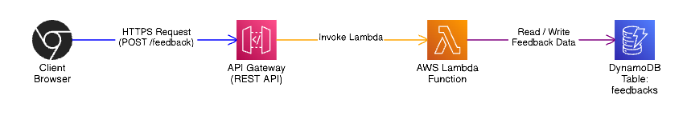

# Architecture Overview

This microservice is built using a serverless, event-driven architecture optimized for scalability and cost efficiency.

## 1. Architecture

## 2. Components and Responsibilities

### **1. Client Browser (Vercel frontend)**
- Collects user input (email, rating, message)
- Sends JSON payload to backend
- Displays success/error messages
- Supports fallback demo mode if AWS is unavailable

### **2. API Gateway**
- Acts as the public entry point  
- Manages routes (/feedback, /status)  
- Enforces CORS policies  
- Throttles traffic and protects backend

### **3. Lambda Function (Core Business Logic)**
Handles all backend responsibilities:
- Input validation (FastAPI)
- Optional reCAPTCHA verification (future use)
- Writing feedback items to DynamoDB
- Status/health checks
- Logging + error handling

Benefits:
- Auto-scaled  
- No server maintenance  
- Very low cost  

### **4. DynamoDB Table**
Stores:
- feedback_id (primary key)
- email
- rating
- message
- timestamp
- tag (future field)

Benefits:
- Fast reads/writes  
- Scales automatically  
- Ideal for microservices  

## 3. Why This Architecture?

### **Serverless = No Ops**
No EC2, containers, or patching.  
AWS handles scaling and availability.

### **Event-Driven**
Lambda runs only when needed → low usage = low cost.

### **Stateless Design**
Frontend and backend are decoupled — easy to replace or expand.

### **Future Proof**
Can extend into:
- Analytics microservice  
- Admin dashboard  
- Public feedback feed  
- Email notification system  

This architecture supports growth without rework.

---