# Screenshots

**01-Form-UI**

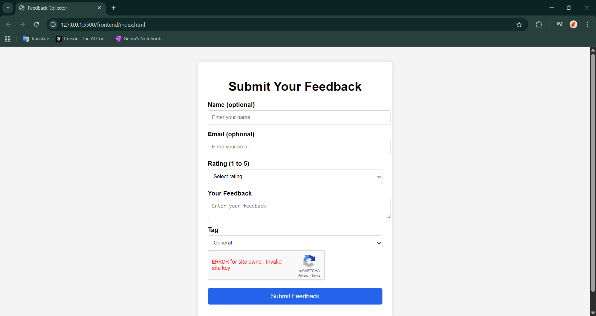

**02-localstorage-queue**

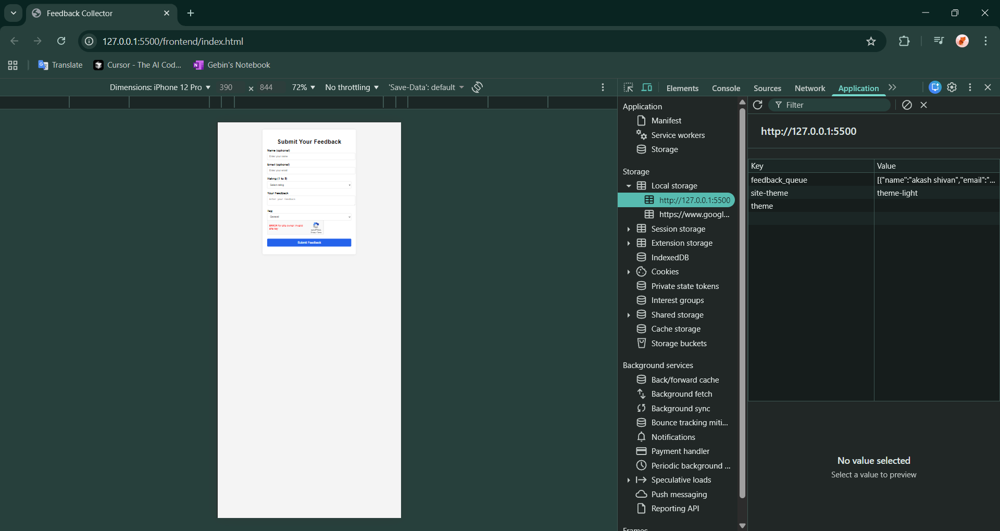

**03-dynamodb-table-created**

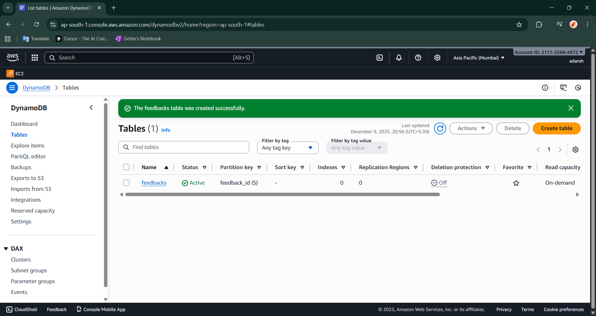

**04-lambda-created**

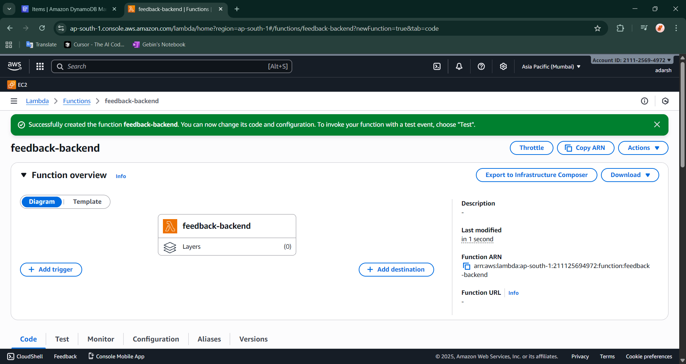

**05-iam-access-keys**

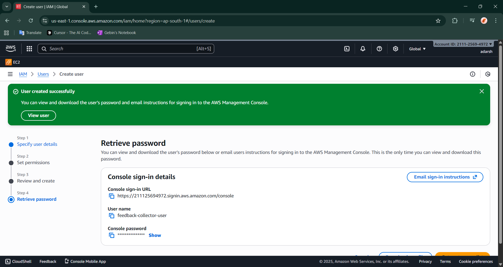

**06-local-feedback**

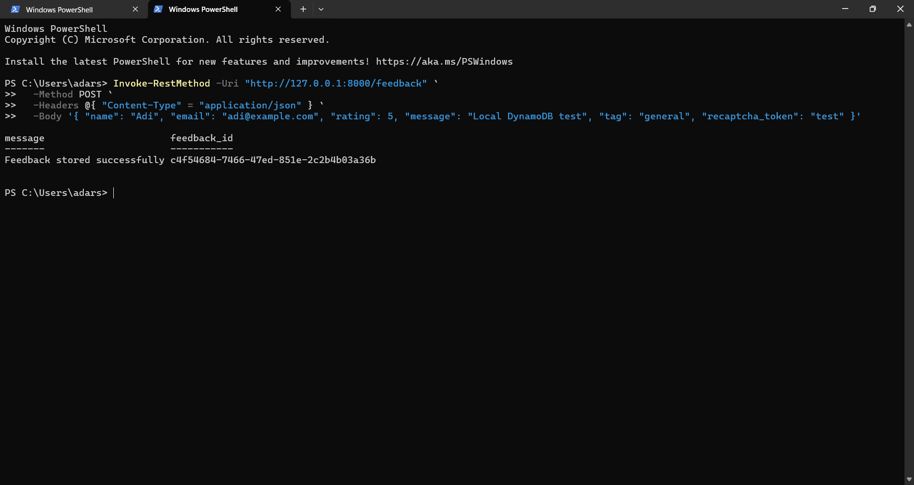

**07-file-zip**

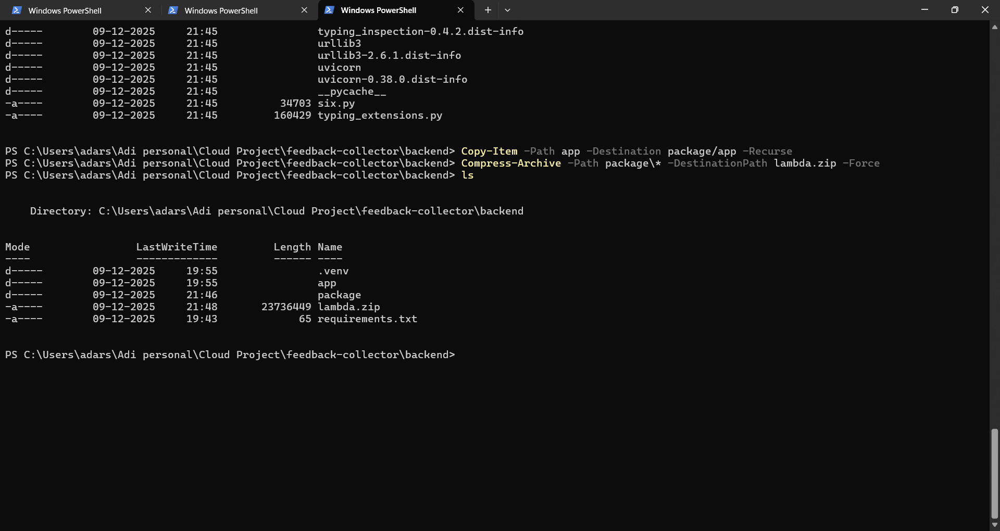

**08-lambda-code-deployed**

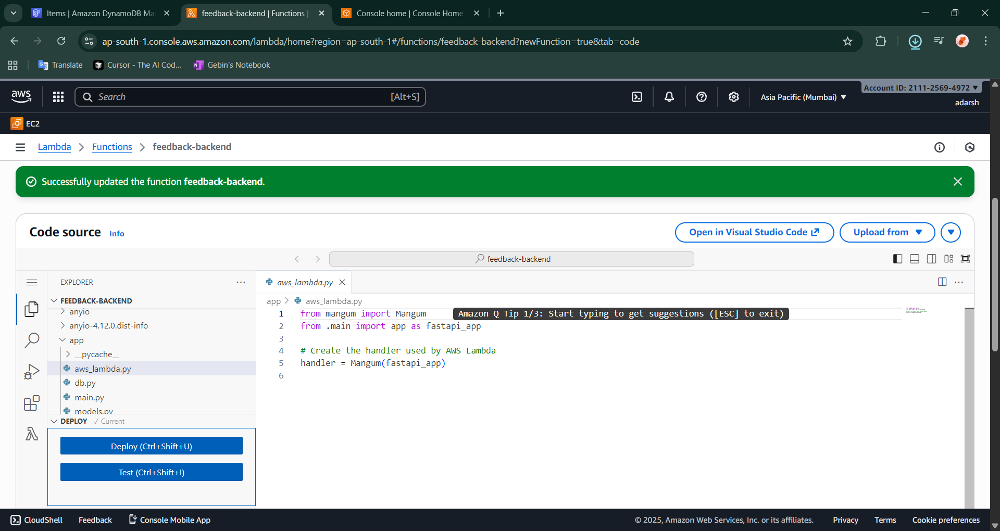

**09-sam-build**

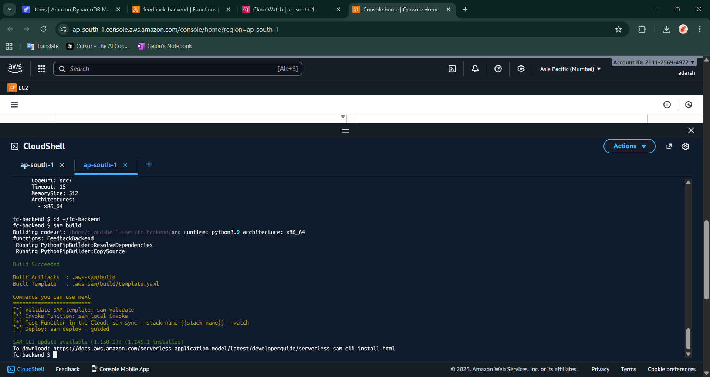

**10-lambda-test**

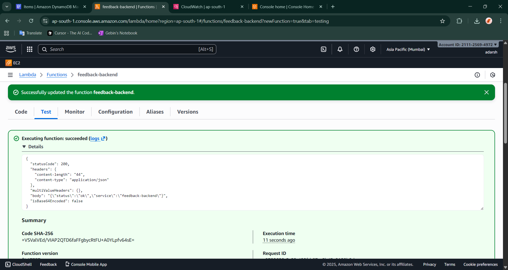

**11-rest-api-created**

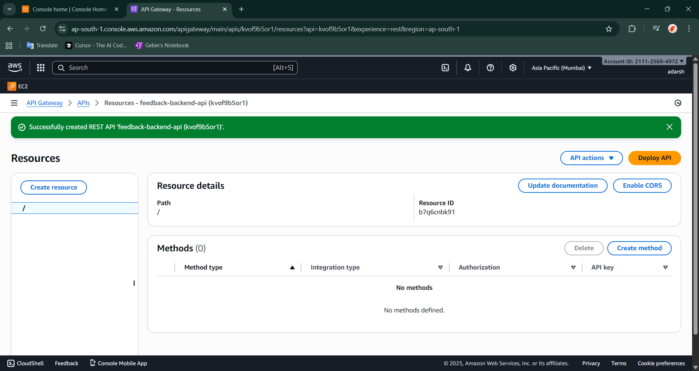

**12-live-test-demo**

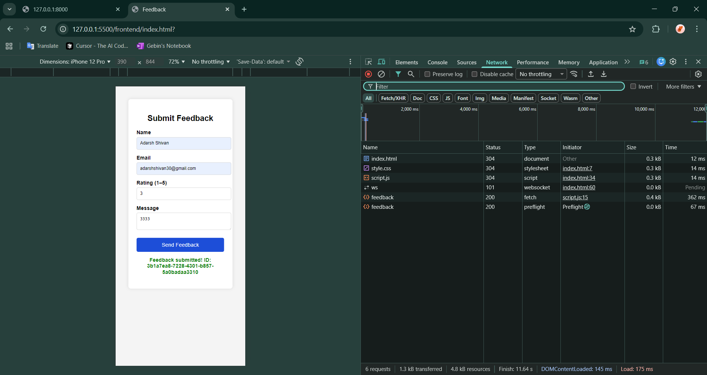

**13-postman-get-test**

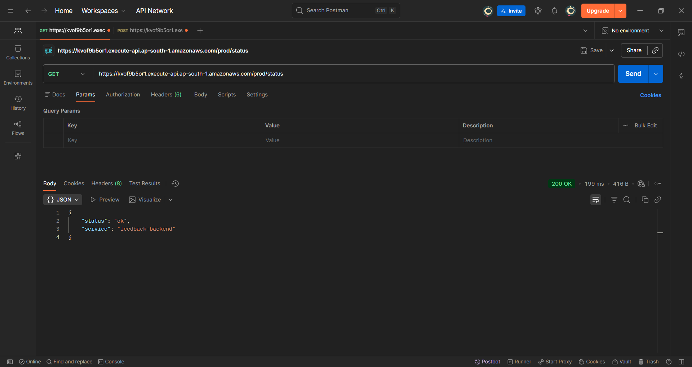

**14-postman-post-test**

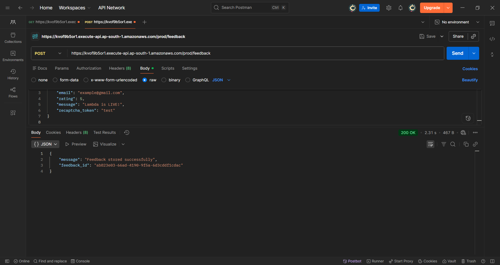

---